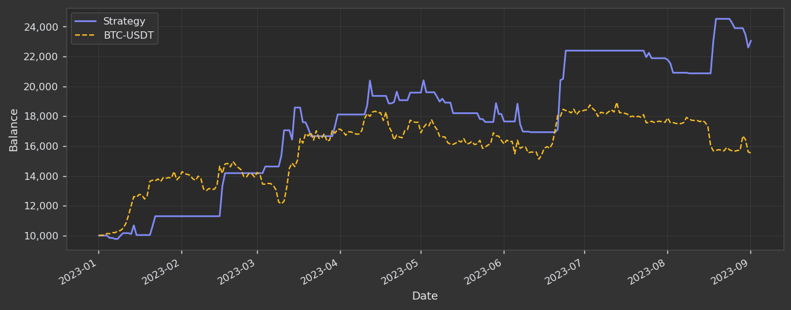
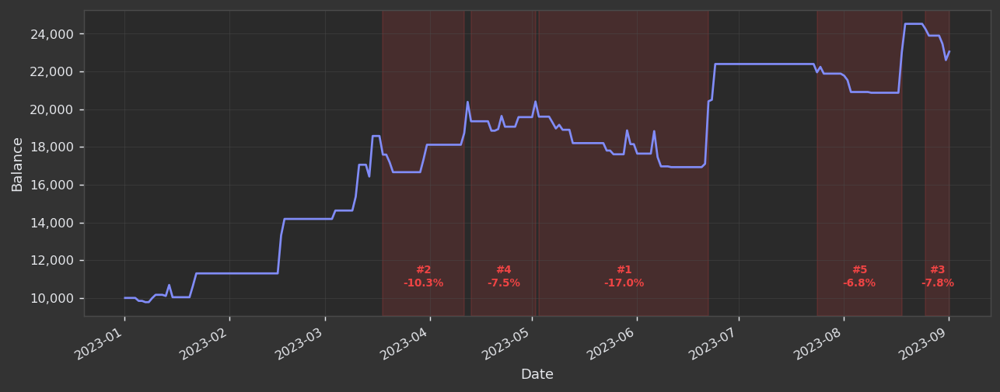
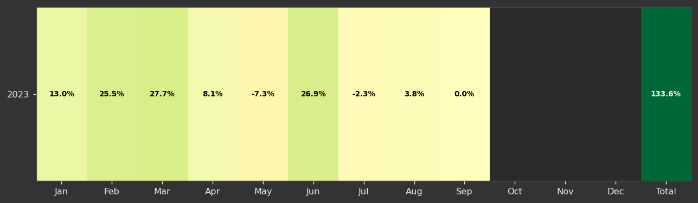
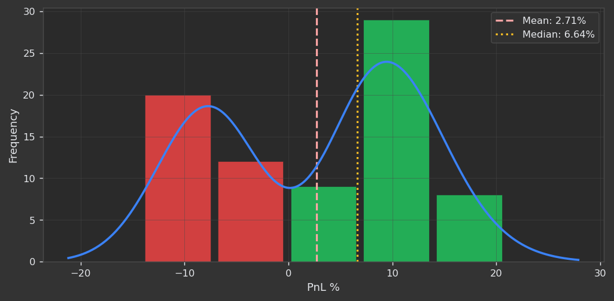

# Use this link to upgrade the backtest engine.

# Backtest Engine
https://docs.jesse.trade/docs/backtest ( this is the most important part of the backtest engine. )
## Backtest Tabs
https://docs.jesse.trade/docs/backtest/tabs
## Backtest Results
https://docs.jesse.trade/docs/backtest/results (this resulst here should be grouped into the three meterics cards [performance, risk, trading-statistics] and each card should have its own metrics from the jesse.trade/docs/backtest/results. The calculations should be done using the jesse.trade/docs/backtest/calculations [https://docs.jesse.trade/docs/backtest/calculations/performance-metrics, https://docs.jesse.trade/docs/backtest/calculations/risk-metrics, https://docs.jesse.trade/docs/backtest/calculations/trading-statistics-metrics, https://docs.jesse.trade/docs/backtest/calculations/trading-statistics-metrics/position-sizing, https://docs.jesse.trade/docs/backtest/calculations/trading-statistics-metrics/position-sizing/position-sizing-by-risk-per-trade, https://docs.jesse.trade/docs/backtest/calculations/trading-statistics-metrics/position-sizing/position-sizing-by-risk-per-trade/position-sizing-by-risk-per-trade/position-sizing-by-risk-per-trade.])

## Backtest Metrics
https://docs.jesse.trade/docs/backtest/metrics
## Backtest Charts
https://docs.jesse.trade/docs/backtest/charts 

## Cumulative Returns vs Benchmark
    
https://docs.jesse.trade/imgs/backtest/cumulative-returns-vs-benchmark.png
## Drawdown — Worst 5 Periods
    
https://docs.jesse.trade/imgs/backtest/drawdown-worst-5-periods.png

## Monthly Distribution
    
https://docs.jesse.trade/imgs/backtest/monthly-distribution.png

## Monthly Returns Heatmap
    
https://docs.jesse.trade/imgs/backtest/monthly-returns-heatmap.png

## Trade PnL Distribution
    
https://docs.jesse.trade/imgs/backtest/trade-pnl-distribution.png

## Backtest Exports
https://docs.jesse.trade/docs/backtest/exports 
## Backtest Benchmark
https://docs.jesse.trade/docs/backtest/benchmark 
## Backtest Live Trading
https://docs.jesse.trade/docs/backtest/live-trading ( this is the most important part of the backtest engine. there should be three tabs [live-trading, api, websocket, rest, orders, positions, orders/cancel, orders/modify, orders/submit, orders/submit] metrics should be same as the jesse.trade/docs/backtest/results in live trading to see the peformaces of the trades in real time. )

# Monte Carlo Analysis
https://docs.jesse.trade/docs/backtest/monte-carlo-analysis 
## Trade Order Shuffling
https://docs.jesse.trade/docs/monte-carlo/trade-order-shuffling 
## Candle Based
https://docs.jesse.trade/docs/monte-carlo/candles-based
## Candle Pipline
https://docs.jesse.trade/docs/monte-carlo/candle-pipelines
## Interpreting Results
https://docs.jesse.trade/docs/monte-carlo/interpreting-results

# Rule Significance Testing
https://docs.jesse.trade/docs/rule-significance-testing/
https://docs.jesse.trade/docs/rule-significance-testing/bootstrap
https://docs.jesse.trade/docs/rule-significance-testing/interpreting-results

## Backtest Optimization